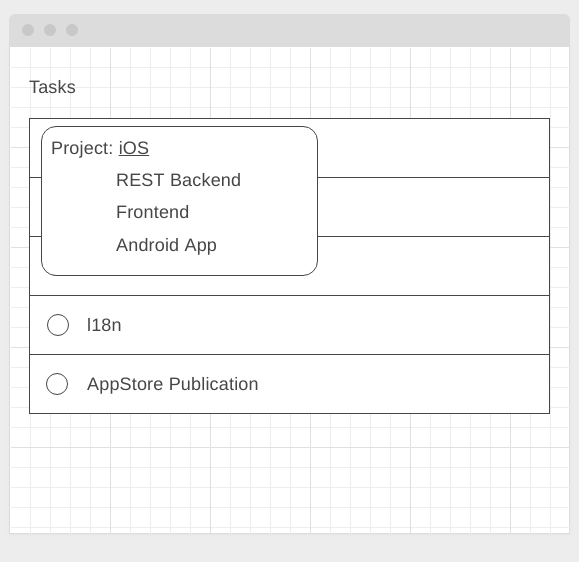

[](https://ci.appveyor.com/project/IlyaDyakonov/rxjs)


# Домашнее задание к занятию "11. RxJS"

Правила сдачи задания:

1. **Важно**: в рамках этого ДЗ можно использовать любой менеджер пакетов
2. Всё должно собираться через Webpack (включая картинки и стили) и выкладываться на Github Pages через Appveyor
3. В README.md должен быть размещён бейджик сборки и ссылка на Github Pages
4. В качестве результата присылайте проверяющему ссылки на ваши GitHub-проекты
5. Авто-тесты писать не требуется
---
**6. (со звездочкой, пункт не обязателен для выполнения)** Серверная часть должна быть выложена на сервере. Вы можете использовать сервер [Vercel](https://vercel.com/docs/concepts/git) (для 1 и 2 задачи, для 3 задачи серверная часть не требуется)

---

## Polling

### Легенда

Вы делаете корпоративную систему, в рамках которой есть система обмена сообщениями, аналогичная email. Вам необходимо реализовать периодический опрос сервера о поступлении новых сообщений. Поскольку для работы в вашей организации используестя rxjs, то и сделать вам это нужно с его помощью.

### Описание

#### Серверная часть

Реализуйте простой REST endpoint `/messages/unread`, который возвращает непрочитанные сообщения. Для генерации случайных данных можете воспользоваться библиотекой [faker](https://www.npmjs.com/package/@faker-js/faker).

Формат выдаваемых сообщений:
```json
{
  "status": "ok",
  "timestamp": 1553400000,
  "messages": [
    {
      "id": "<uuid>",
      "from": "anya@ivanova",
      "subject": "Hello from Anya",
      "body": "Long message body here" ,
      "received": 1553108200
    }
    {
      "id": "<uuid>",
      "from": "alex@petrov",
      "subject": "Hello from Alex Petrov!",
      "body": "Long message body here",
      "received": 1553107200
    },
    ...
  ]
}
```

#### Клиентская часть

На клиенте с помощью rxjs вам нужно реализовать виджет, подписывающийся на "обновления". При получении обновлений они должны добавляться в таблицу сообщений:


Сообщения добавляются именно сверху, предыдущие не удаляются.

Для получения данных через определённые промежутки используйте оператор `interval`.

Для запросов используйте [ajax](https://rxjs-dev.firebaseapp.com/api/ajax/ajax):
```javascript
import { ajax } from 'rxjs/ajax';

ajax.getJSON(<url>);
```

Обратите внимание:
1. Сообщения лежат в свойстве `messages`
1. При отображении вам нужно сокращать `subject` до 15 символов, если длина больше, то последние название сокращается до 15 символов и дополняется символом многоточия
1. Дата при отображении переводится из timestamp в формат ЧЧ:ММ ДД.ММ.ГГГГ

При получении ошибки (сервер недоступен, либо код ответа не 200), преобразовывайте ошибку так, чтобы это было аналогично отсутствию новых сообщений.

---

## Posts with comments* (задача со звёздочкой)

Важно: эта задача не является обязательной. Её (не)выполнение не влияет на получение зачёта по ДЗ.

### Легенда

Вы работаете в компании, занимающейся созданием социальной платформы. А конкретно ваша команда - занимается блоком, связанным с лентой последних постов. Соответственно, вам нужно грузить список последних постов, а поскольку платформа всё-таки социальная, к каждому посту список последних комментариев.

Понятное дело, что по-хорошему, нужно чтобы с сервера приходили посты сразу со списком последних комментариев, но пока разработчики сервеной части упёрлись и сказали, что всё будет отдельно, а именно:
* получение списка последних постов
* получение последних комментариев к конкретному посту по id

### Описание

#### Серверная часть

Как всегда, у разработчиков серверной части ещё ничего не готово, и чтобы не ждать их, вам нужно разработать демо REST-сервер со следующими endpoint'ами:
* GET /posts/latest - список последних постов (не более 10) в формате:
```json
{
  "status": "ok",
  "data": [
    {
      "id": "<id>",
      "author_id": "<author_id>",
      "title": "<title>",
      "author": "<author>",
      "avatar": "<avatar>",
      "image": "<url>",
      "created": "<timestamp>"
    },
    ...
  ]
}
```
* GET /posts/\<post_id\>/comments/latest - список последних комментариев к посту (не более 3) в формате:
```json
{
  "status": "ok",
  "data": [
    {
      "id": "<id>",
      "post_id": "<post_id>",
      "author_id": "<author_id>",
      "author": "<author>",
      "avatar": "<avatar>",
      "content": "<content>",
      "created": "<timestamp>"
    },
    ...
  ]
}
```

Для генерации данных можете использовать данные с [jsonplaceholder](https://jsonplaceholder.typicode.com) или библиотеку [faker](https://www.npmjs.com/package/@faker-js/faker)

#### Клиентская часть

С использованием библиотеки rxjs организуйте получение данных о постах и загрузки для каждого поста комментариев так, чтобы в `subscribe` получать уже посты с комментариями (используйте для этого соответствующие операторы).

Общий вид одного поста:


Функциональность кнопки "Load More" реализовывать не нужно.

---

## Project Management Dashboard* (задача со звёздочкой)

Важно: эта задача не является обязательной. Её (не)выполнение не влияет на получение зачёта по ДЗ.

### Легенда

Вы делаете рабочее место менеджера проектов, который может отслеживать как задачи по конкретному проекту, так и общую статистику по проектам.

В вашу задачу входит реализация двух виджетов:
1. Виджет статистики открытых задач по каждому проекту
1. Виджет просмотра задач

### Описание

Реализуйте на базе State Management общее состояние приложение, где задачи хранятся в стейт-менеджере, а виджеты получают `Store` через конструктор, подписываясь на состояние.

Как это должно выглядеть:


Для выбора проекта:



Все данные храните в памяти (серверная часть не нужна). Для хранения используйте следующую структуру:

```javascript
{
  "projects": [
    ...,
    {
      "id": 4,
      "name": "iOS App",
      "tasks": [
        {
          "id": 25,
          "name": "Push Notifications",
          "done": true
        },
        {
          "id": 26,
          "name": "Apple Pay Support",
          "done": false
        },
        ...
      ]
    }
  ]
}

```

При завершении задач (установка флажка) в правом виджете, количество открытых задач в левом виджете должно автоматически обновляться. То же касается снятия флажка.

Обратите внимание: виджеты не должны ничего знать друг о друге и должны быть способны функционировать отдельно.
